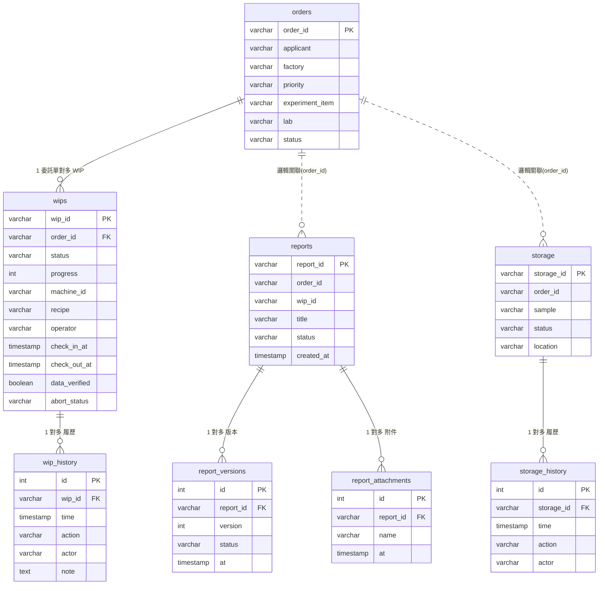

# 組員 D 資料庫設計（實驗執行 / 報告 / 結單 / 倉儲）

對應實作 `backend/app/models.py`、migration `backend/alembic/versions/0001_initial.py`。
狀態類欄位的合法值見 `backend/app/enums.py`。

## ER 圖

> 實線 `||--o{`＝資料庫外鍵（強制）；虛線 `||..o{`＝邏輯關聯（以 `order_id` 對應，未設外鍵約束，方便各模組獨立開發）。

---

## orders（委託單）

| 欄位名稱 | 型態 | 說明 |
|----------|------|------|
| order_id | varchar(32) PK | 委託單編號，如 `WO-2024-0891` |
| applicant | varchar(64) | 申請人 |
| factory | varchar(32) | 廠區（F6/F8/F12 廠） |
| priority | varchar(16) | 優先級（特急/高/一般） |
| experiment_item | varchar(64) | 實驗項目 |
| lab | varchar(64) | 負責實驗室 |
| status | varchar(16) | 委託單狀態（見 enums.OrderStatus：實驗中/待結果確認/已完成/待報告回傳/待取件/已結案…） |

## wips（在製品 / 實驗單）

| 欄位名稱 | 型態 | 說明 |
|----------|------|------|
| wip_id | varchar(32) PK | WIP 編號，如 `WIP-0891-01` |
| order_id | varchar(32) FK→orders | 所屬委託單 |
| sample | varchar(64) | 樣品 |
| experiment_item | varchar(64) | 實驗項目 |
| machine_id | varchar(32) null | 上機機台編號 |
| recipe | varchar(32) null | Recipe 版本 |
| status | varchar(16) | WIP 狀態（enums.WipStatus：待上機/執行中/已下機/待確認/已完成/已終止） |
| progress | integer | 進度百分比 0–100，預設 0 |
| operator | varchar(32) null | 操作人 |
| check_in_at | timestamp null | 上機時間 |
| check_out_at | timestamp null | 下機時間 |
| result_note | text null | 結果備註 |
| raw_data_url | varchar(255) null | 原始數據連結 |
| data_verified | boolean | 數據完整性是否已驗證，預設 false |
| abort_reason | text null | 中止申請原因 |
| abort_by | varchar(32) null | 中止申請人 |
| abort_status | varchar(16) null | 中止狀態（待主管判定/已終止/已駁回） |
| abort_requested_at | timestamp null | 中止申請時間 |
| abort_resolution | text null | 主管處理結果說明 |

## wip_history（上下貨履歷，只新增不刪除）

| 欄位名稱 | 型態 | 說明 |
|----------|------|------|
| id | integer PK (自增) | 流水號 |
| wip_id | varchar(32) FK→wips | 所屬 WIP |
| time | timestamp | 事件時間 |
| action | varchar(32) | 事件動作（上機/下機/更新進度/上傳結果/確認結果…） |
| actor | varchar(32) | 操作者 |
| note | text | 備註 |

## reports（實驗報告）

| 欄位名稱 | 型態 | 說明 |
|----------|------|------|
| report_id | varchar(32) PK | 報告編號，如 `RPT-0896-01` |
| order_id | varchar(32) | 對應委託單（邏輯關聯） |
| wip_id | varchar(32) | 來源 WIP（邏輯關聯） |
| title | varchar(128) | 報告標題 |
| summary | text | 摘要 |
| conclusion | text | 結論 |
| status | varchar(16) | 報告狀態（enums.ReportStatus：草稿/待審核/已確認/已發布/已回傳/已改版） |
| created_at | timestamp | 建立時間 |
| created_by | varchar(32) | 建立者 |

## report_versions（報告版本，只新增）

| 欄位名稱 | 型態 | 說明 |
|----------|------|------|
| id | integer PK (自增) | 流水號 |
| report_id | varchar(32) FK→reports | 所屬報告 |
| version | integer | 版本序號 |
| status | varchar(16) | 該版當下狀態 |
| at | timestamp | 異動時間 |
| actor | varchar(32) | 操作者 |
| note | text | 異動說明（提交審核/主管確認/發布…） |

## report_attachments（報告附件）

| 欄位名稱 | 型態 | 說明 |
|----------|------|------|
| id | integer PK (自增) | 流水號 |
| report_id | varchar(32) FK→reports | 所屬報告 |
| name | varchar(128) | 附件檔名 |
| at | timestamp | 上傳時間 |

## storage（樣品倉儲）

| 欄位名稱 | 型態 | 說明 |
|----------|------|------|
| storage_id | varchar(32) PK | 倉儲編號，如 `ST-2024-0896` |
| order_id | varchar(32) | 對應委託單（邏輯關聯） |
| sample | varchar(64) | 樣品 |
| qty | varchar(32) | 數量 |
| status | varchar(16) | 倉儲狀態（enums.StorageStatus：實驗室/已入庫/待返還/已取件） |
| location | varchar(32) | 儲位 |

## storage_history（倉儲履歷，只新增）

| 欄位名稱 | 型態 | 說明 |
|----------|------|------|
| id | integer PK (自增) | 流水號 |
| storage_id | varchar(32) FK→storage | 所屬倉儲紀錄 |
| time | timestamp | 事件時間 |
| action | varchar(32) | 事件動作（建立倉儲紀錄/入庫/出庫取件） |
| actor | varchar(32) | 操作者 |
| note | text | 備註 |
